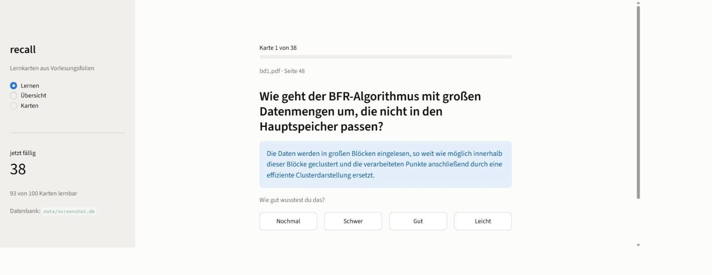
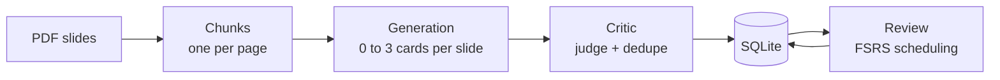
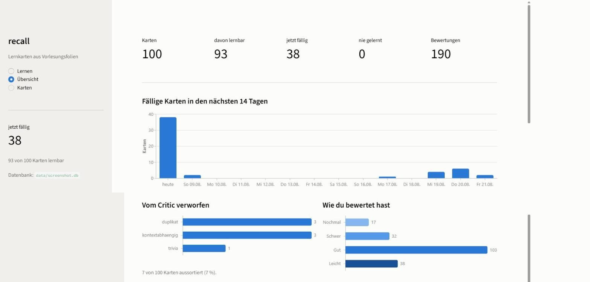
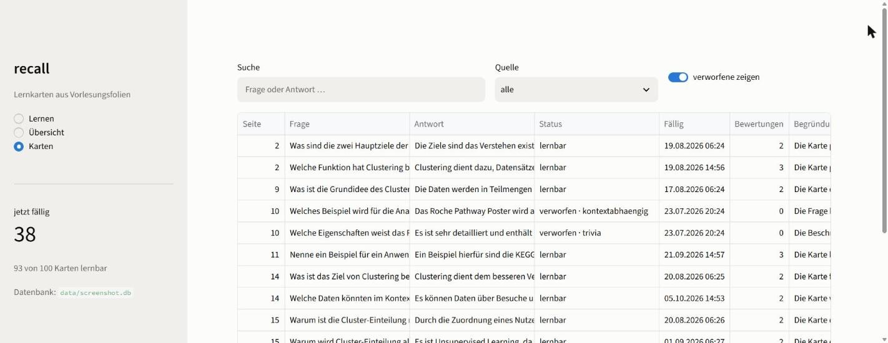

# recall

**Turns lecture slides into flashcards. A second LLM pass throws out the bad ones.**

[](https://github.com/AaronHabyarimana/recall/actions/workflows/ci.yml)

[](https://github.com/AaronHabyarimana/recall/pkgs/container/recall)
[](LICENSE)



## Run it without cloning

The image ships with the demo deck. Load the 17 sample cards, then open
http://localhost:8501.

```bash
docker run --rm -v recall-data:/data ghcr.io/aaronhabyarimana/recall \
  review import samples/demo_cards.json --db /data/recall.db

docker run --init --rm -p 8501:8501 -v recall-data:/data ghcr.io/aaronhabyarimana/recall
```

## Why

Rereading slides is not studying. Flashcards work, but writing them takes as long as
the studying you wanted to skip. So a model writes them.

The problem is what the model writes. It sees one slide at a time. That gives you
questions like *"Which poster is shown as an example?"*, which need the slide sitting
next to you, and it asks about the same concept several times across a long deck.

So there is a second stage. A critic reads the cards back, drops the ones you cannot
learn from, and records a reason for each. On the deck this was built for it cut 7 of
100 cards.

## Pipeline



| Stage | What it does |
|---|---|
| **Ingest** | PyMuPDF, one chunk per page. Removes lines that repeat on more than half the pages, normalises bullet glyphs, drops page numbers and near empty slides, and collapses build-up slides that appear several times with growing content. |
| **Generate** | One request per slide, 0 to 3 cards. A slide with nothing worth asking about produces nothing. |
| **Critic** | Two checks. A **judge** rates cards in batches of ten against three failure modes: `kontextabhaengig` (needs the slide), `trivia` (not a concept), `unklar` (the answer does not answer the question). A **deduper** finds repeats across slides. Nothing is deleted. Every card keeps its verdict and reason. |
| **Review** | Cards land in SQLite. Scheduling is [FSRS](https://github.com/open-spaced-repetition/py-fsrs), the algorithm Anki uses, targeting 90% recall. |

Each stage reads and writes JSON, so you can open the intermediate files and fix them
by hand before the next stage runs.

## Quickstart

Needs [uv](https://docs.astral.sh/uv/) and Python 3.12+.

```bash
git clone https://github.com/AaronHabyarimana/recall
cd recall
uv sync
```

**Without an API key.** The repo ships 17 real cards from the deck this was built on,
including the three the critic threw out:

```bash
uv run recall review import samples/demo_cards.json --db data/demo.db
uv run recall ui --db data/demo.db
```

**On your own slides.** Copy `.env.example` to `.env` and put a
[Gemini API key](https://aistudio.google.com/apikey) in it. The free tier is enough.

```bash
uv run recall ingest   data/slides.pdf                          # look at what was extracted
uv run recall generate data/slides.pdf --out data/cards.json
uv run recall critic   data/cards.json --out data/judged.json
uv run recall review import data/judged.json
uv run recall ui
```

`recall review lernen` reviews in the terminal instead. `recall --help` lists everything.

## HTTP API

The same database over HTTP, for anything that is not the Streamlit UI.

```bash
uv run recall api --db data/demo.db
```

| Endpoint | What it returns |
|---|---|
| `GET /health` | Readiness and card count |
| `GET /stats` | Totals, due count, review count |
| `GET /cards` | All cards, filterable by `suche`, `quelle` and `verworfene` |
| `GET /cards/{card_id}` | One card with the critic's verdict |
| `GET /due` | Cards due now, longest overdue first |
| `POST /reviews` | Records a rating and returns the next due date |

Interactive docs are at `/docs`, built from the same models the API validates against.

## Docker

One image, two services, one shared database volume.

```bash
docker compose up          # UI on 8501, API on 8000
```

`recall` is the container entry point, so `docker run <image> review stats` does the
same as the local command.

## Design decisions

**Card identity comes from content.** `card_id` is
`sha256(question | source_file | page_number)[:12]`, so re-importing after a critic run
updates cards in place with no ID mapping and no migration. The answer is left out of
the hash on purpose. Fixing a wrong answer should not create a new card and reset weeks
of scheduling.

**Deduplication needs two stages.** First a cheap `difflib` filter over normalised
questions, then the model judges only the pairs that survive. The reason is concrete.
In the real deck the most similar pair was *"How does the agglomerative process
start?"* and *"How does the divisive process start?"*. Same words, opposite content. A
threshold alone deletes one of them.

**FSRS state is a JSON blob, with `due` in its own column.** Stability, difficulty and
step are internals that change between FSRS versions, and columns for them would mean a
migration on every upgrade. But "which cards are due" has to be answerable in SQL, so
that one field is duplicated out where an index reaches it.

**Every review is logged, although nothing reads the log yet.** The FSRS optimiser fits
per-user parameters from review history. That history cannot be reconstructed later. If
you do not record it from the first card, the option is gone.

**The database lives on a volume, not in the container.** SQLite is a file, and a
container's filesystem goes away with the container. Without `-v recall-data:/data`
every `docker run` starts from zero. The UI and the API share one file, which works
because both run short transactions. Several people learning at once would need
Postgres.

**The Streamlit layer has no tests.** `ui/app.py` is 299 lines of view code and testing
it properly costs more than it returns. The queries behind it sit in `review/db.py` and
are covered there. Coverage is 86 percent without the view layer and 71 percent with it.

**The pipeline stays on the command line. Only reviewing is in the browser.** Generating
cards for a full deck takes minutes of API calls, and Streamlit re-runs its script on
every click, which is the wrong shape for a batch job.

## Screenshots

What is due, what the critic threw out and why, and how you have been rating.



The full collection, searchable and filterable, including the rejected cards with the
critic's reasoning.



## Development

```bash
uv run pytest          # 146 tests, no network
uv run ruff check .
uv run ruff format --check .
uv run mypy
```

The tests never call the API. LLM behaviour is covered by testing prompt construction
and response parsing against recorded replies, plus the retry logic against a stub.

```
src/recall/
├── cli.py           one entry point over all stages
├── llm_client.py    Gemini wrapper, retries on rate limits
├── ingestion/       PDF to chunks, cleaning
├── generation/      chunks to cards
├── critic/          judge.py (quality) + dedupe.py (repeats)
├── review/          FSRS scheduling, SQLite, terminal CLI
├── api/             FastAPI over the same queries
└── ui/              Streamlit app
```

## A note on language

The code, the CLI and the interface are German, because the tool was built for German
lecture slides and the prompts have to match the language of the material. The README is
in English.

## License

MIT, see [LICENSE](LICENSE).
