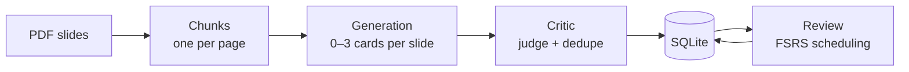

# recall

**Turns lecture slides into spaced-repetition flashcards — with a second LLM pass that throws away the bad ones.**

[](https://github.com/AaronHabyarimana/recall/actions/workflows/ci.yml)

[](LICENSE)


## Why

Rereading slides feels like studying and isn't. Flashcards work, but writing them is exactly
the work you were trying to avoid — so let a model write them.

The catch is that generated cards are only half usable. A slide showing an example diagram
yields *"Which poster is shown as an example?"* — a question that is unanswerable without the
slide sitting right next to it. And because the generator sees one slide at a time, the same
concept comes back as four near-identical cards across a 60-slide deck.

So generation is only half the pipeline. The other half is a **critic** that reads the cards
back and drops the ones that can't be learned from. On the deck this was built for, it kept
93 of 100 cards and named a reason for each of the seven it cut.

## Pipeline



| Stage | What it does |
|---|---|
| **Ingest** | PyMuPDF, one chunk per page. Strips lines that repeat on >50% of pages (running headers), normalises bullet glyphs, drops page numbers and near-empty slides, and discards the earlier versions of build-up slides that appear three times with growing content. |
| **Generate** | One request per slide, 0–3 cards. A slide with nothing worth asking about is allowed to produce nothing. |
| **Critic** | Two independent checks. A **judge** rates cards in batches of ten against three failure modes: `kontextabhaengig` (unanswerable without the slide), `trivia` (not a concept), `unklar` (the answer doesn't answer the question). A **deduper** finds repeats across slides. Nothing is deleted — every card keeps its verdict and reason. |
| **Review** | Cards land in SQLite. Scheduling is [FSRS](https://github.com/open-spaced-repetition/py-fsrs), the same algorithm Anki uses, targeting 90% recall. |

Each stage reads JSON and writes JSON, so you can open the intermediate files, see what the
model did, and fix it by hand before the next stage runs.

## Quickstart

Needs [uv](https://docs.astral.sh/uv/) and Python 3.12+.

```bash
git clone https://github.com/AaronHabyarimana/recall
cd recall
uv sync
```

**Try it without an API key.** The repo ships 17 real cards from the deck this was built on,
including the three the critic threw out:

```bash
uv run recall review import samples/demo_cards.json --db data/demo.db
uv run recall ui --db data/demo.db
```

**Run the full pipeline on your own slides.** Copy `.env.example` to `.env` and put a
[Gemini API key](https://aistudio.google.com/apikey) in it — the free tier is enough:

```bash
uv run recall ingest   data/slides.pdf                          # look at what was extracted
uv run recall generate data/slides.pdf --out data/cards.json
uv run recall critic   data/cards.json --out data/judged.json
uv run recall review import data/judged.json
uv run recall ui
```

`recall review lernen` does the same reviewing in the terminal if you prefer that.
`recall --help` lists everything.

## Design decisions

**Card identity is derived from content, not assigned.** `card_id` is
`sha256(question | source_file | page_number)[:12]`. Re-running the critic and re-importing
therefore updates cards in place with no ID mapping and no migration step. The *answer* is
deliberately left out of the hash: correcting a wrong answer should fix the card, not replace
it with a new one and silently reset weeks of scheduling.

**Deduplication is two-stage, and it has to be.** Stage one is a cheap `difflib` similarity
filter over normalised questions; stage two asks the model to judge only the surviving pairs.
The split isn't caution — in the real deck, the single most textually similar pair of questions
is *"How does the agglomerative process start?"* / *"How does the divisive process start?"*.
Same words, opposite content. A threshold alone deletes one of them.

**FSRS state is stored as an opaque JSON blob, with `due` broken out as its own column.**
Stability, difficulty and step are algorithm internals that change between FSRS versions;
pinning them into columns would mean a schema migration every upgrade. But *"which cards are
due"* has to be answerable in SQL, so that one field is duplicated out where an index can reach
it.

**Every review is logged from day one, although nothing reads the log yet.** FSRS ships an
optimiser that fits per-user parameters from review history. That history cannot be
reconstructed after the fact — if you don't record it from the first card, the option is gone.

**The pipeline stays on the command line; only reviewing is in the browser.** Generating cards
for a full deck takes minutes of API calls. Streamlit re-runs its script on every click, which
is the wrong shape for that job — and a progress bar in front of a batch job is a worse
experience than a terminal that just prints what it's doing.

## Screenshots

The overview: what's due, what the critic threw out and why, and how you've been rating.


The full collection, searchable and filterable — including the rejected cards with the critic's
reasoning, which is the most interesting thing in the database.


## Development

```bash
uv run pytest          # 83 tests, no network
uv run ruff check .
```

The tests never call the API. LLM behaviour is covered by testing prompt construction and
response parsing against recorded replies, plus the retry logic against a stubbed client.

```
src/recall/
├── cli.py           one entry point over all stages
├── llm_client.py    Gemini wrapper, retries on rate limits
├── ingestion/       PDF → chunks, cleaning
├── generation/      chunks → cards
├── critic/          judge.py (quality) + dedupe.py (repeats)
├── review/          FSRS scheduling, SQLite, terminal CLI
└── ui/              Streamlit app
```

## A note on language

The code, the CLI and the interface are German, because the tool was built for German lecture
slides and the prompts have to be written in the language of the material. The architecture and
this README are in English.

## License

MIT — see [LICENSE](LICENSE).
